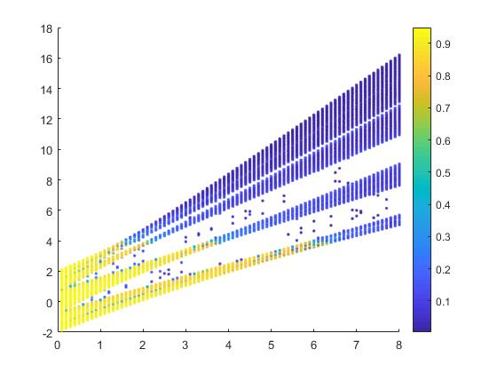

# StatisticsOfDisorderSystem
We have collected some commonly used functions when studying Anderson localization and quasi-periodic localization. \
These functions can be divided into five parts: \
(a) plot. (b) statistics of the eigenstates. (c) statistics of the eigenvalues. (d) statistics of the dynamics. (e) typical Hamiltonians.
 
## Plot
1. (EVIprPlot) :we use the code (EVIprPlot) to plot this figure. 

## Statistics of the eigenstates.
1.（Ipr）： calculate the Ipr for a single eigenstate.\
2.（Localizationlength）： given an eigenstate and calculate the localization length.\
3. (scalingexponent) : get the scalingexponent by the system size and IPR data.  

## Statistics of the eigenvalues
1. (Energyratio) :calculate the energy level sacing ratio.\
2. (Boxcounting) : calculate the spectral fractal dimendion.

## Statistics of the dynamics
1. (x2) : claculate <x^2>

## Typical Hamiltonians
1. (getGAA) :get the single particle Hamiltonian of the Generalized AA model(a quasiperiodic system with multifractal states.)
